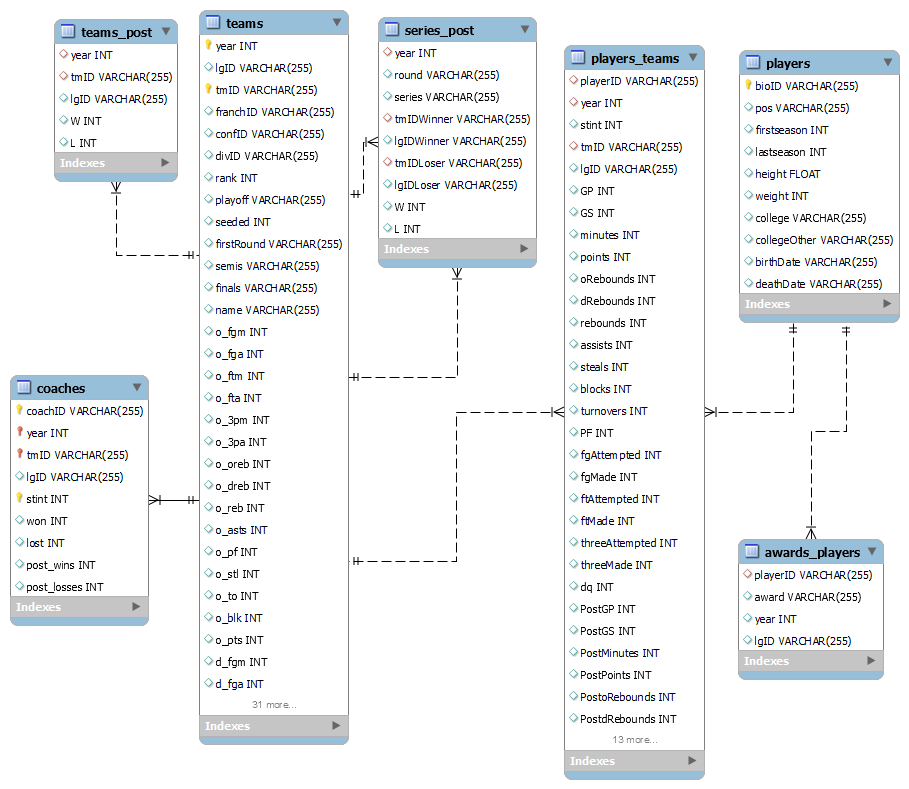

# FEUP-AC 2023/2024

### Project

- **Course**: Master's Degree in Informatics and Computing Engineering
- **Class**: AC...
- **Date**: 1st Year, 1st Semester 2023/2024,

### Group

This project was developed by:

- [Joāo Pereira](https://github.com/ttoino)
- [Nuno Pereira](https://github.com/)
- [Sofia Merino Costa](https://github.com/sophie-mc-dev)

### Folder Structure

- data
- docs
- img
- src

### Case description

Basketball playoffs qualification.

### Task description

Basketball tournaments are usually split in two parts. First, all teams play each other aiming to achieve the greatest number of wins possible. Then, at the end of the first part of the season, a pre determined number of teams which were able to win the most games are qualified to the playoff season, where they play series of knock-out matches for the trophy.

For the 10 years, data from players, teams, coaches, games and several other metrics were gathered and arranged on this dataset. The goal is to use this data to predict which teams will qualify for the playoffs in the next season.

### Domain desciption



### Start Project:

1. Clone the repository:

```
git clone https://github.com/...
```

2. Install required dependencies:

```
pip3 install -r requirements.txt
```

### Requirements

- Python 3.x
- Jupyter Notebooks
- Required Python libraries (specified in requirements.txt)
